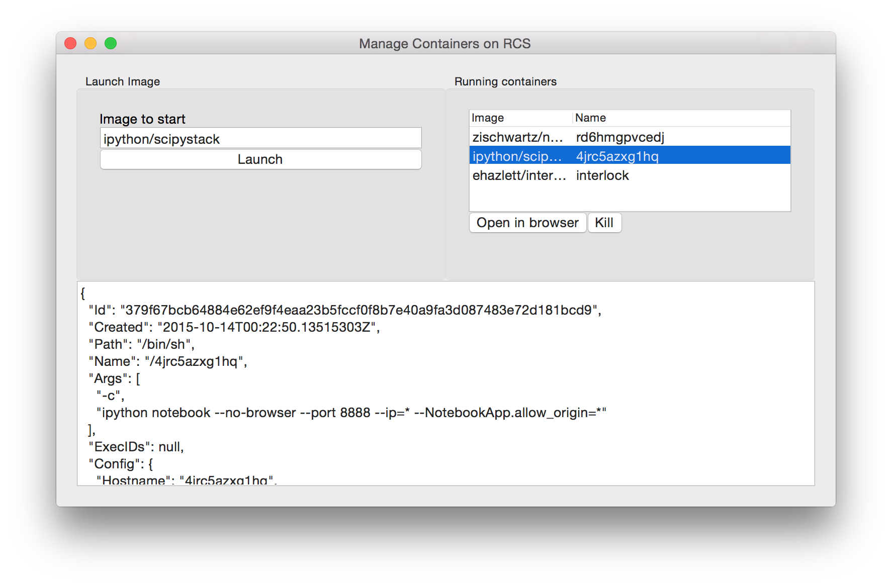

# GUI for launching notebooks on RCS swarm

Provides a super simple GUI based on https://github.com/andlabs/ui to manage notebooks on an RCS swarm:



To run:

* Clone this repo
* Start interlock on your cluster
* Set up DNS and DNS wildcards
* Update the `.env` file with your own settings for `DOMAIN_NAME`


## Starting interlock

```
docker run -d \
   --name interlock \
   -p 80:80 \
   -P \
   --hostname i4.odewahn.com \
   --volumes-from swarm-data \
   ehazlett/interlock \
   --swarm-url $DOCKER_HOST \
   --swarm-tls-ca-cert=/etc/docker/ca.pem  \
   --swarm-tls-cert=/etc/docker/server-cert.pem \
   --swarm-tls-key=/etc/docker/server-key.pem \
   --plugin haproxy start
```

## Running in Development

* Copy a cert file for the cluster to you machine
* Edit the `.env` file to point to your cert
* `go get` to grab dependencies

Then, once you've done this:

```
go run *.go
```

## Building a binary (OSX)

```
GOOS=linux go build -a -installsuffix cgo -o rcs-manager .
docker build --no-cache -t swarm-manager .
```

Then, once you build the binary, you have to do `chmod +x rcs-manager` for it to be executable


## References

* https://github.com/andlabs/ui  -- UI client library
* https://godoc.org/github.com/andlabs/ui --- Godocs for the UI library
* https://github.com/samalba/dockerclient  -- Docker client clibrary documentation
* http://www.gtk.org/features.php
